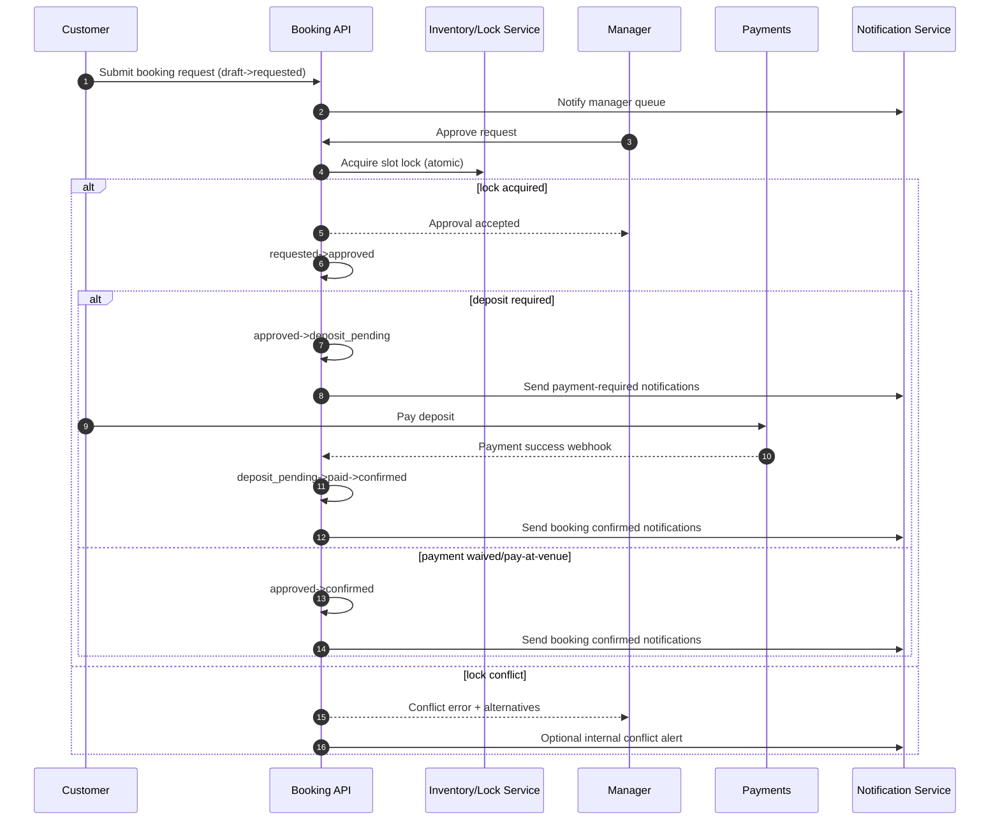

# Booking Workflow Product/Technical Specification

## 1) Purpose and Scope

This document defines the end-to-end booking workflow for the venue platform, including:

- User roles and permissions.
- Booking lifecycle/state machine.
- Allowed actions per role and state.
- Concurrency and timing edge cases.
- Notifications required for each state transition.
- Canonical interaction flows for customer request and manager approval.

This spec is intended for product, backend, frontend, QA, and operations teams.

---

## 2) User Roles

### 2.1 Customer
An end user requesting and managing their own booking.

Core capabilities:
- Create draft booking.
- Submit request.
- Pay deposit/full amount when requested.
- Cancel within policy window.
- View booking status and notifications.

Constraints:
- Can act only on own bookings (except publicly shared booking references if product allows read-only lookup).

### 2.2 Employee
Frontline venue staff (e.g., host, concierge) handling intake and operational updates.

Core capabilities:
- View bookings for assigned venue/location.
- Add internal notes.
- Mark customer arrival and completion events (if delegated).
- Escalate to manager for approval/override decisions.

Constraints:
- Cannot approve/reject requests unless explicitly granted via policy.
- Cannot perform manager-only overrides.

### 2.3 Manager
Venue decision-maker with booking authority.

Core capabilities:
- Approve/reject requests.
- Override booking constraints within policy (capacity, conflict resolution, cancellation exceptions).
- Trigger manual payment/deposit grace periods.
- Finalize operational states (confirmed/completed/cancelled/no_show).

Constraints:
- Scope limited to managed venues.
- Overrides must be auditable.

### 2.4 Platform Admin
Global operator for platform-wide governance.

Core capabilities:
- View and intervene across all venues.
- Apply policy updates and emergency actions.
- Resolve disputes and enforce compliance.
- Access full audit logs and notification traces.

Constraints:
- Actions are high-privilege and must be strongly audited.

---

## 3) Booking State Machine

Canonical progression:

`draft -> requested -> approved/rejected -> paid/deposit_pending -> confirmed -> completed/cancelled/no_show`

> Notes:
> - `approved/rejected` indicates a decision branch from `requested`.
> - `paid/deposit_pending` indicates payment branch from `approved`.
> - Final operational outcomes are `completed`, `cancelled`, or `no_show`.

### 3.1 State Definitions

1. **draft**
   - Booking being composed by customer (not visible in queue for manager decision).
2. **requested**
   - Customer submitted booking request; awaiting decision.
3. **approved**
   - Manager accepted request; payment step required unless waived.
4. **rejected**
   - Manager declined request; booking closes unless customer resubmits as new request.
5. **deposit_pending**
   - Approved booking requires deposit and is waiting for payment before timeout.
6. **paid**
   - Required payment completed successfully.
7. **confirmed**
   - Booking guaranteed and operationally scheduled.
8. **completed**
   - Booking service fulfilled.
9. **cancelled**
   - Booking cancelled by customer/manager/admin under policy.
10. **no_show**
    - Customer did not arrive within venue no-show policy.

### 3.2 Valid Transitions

- `draft -> requested`
- `requested -> approved`
- `requested -> rejected`
- `approved -> deposit_pending` (if deposit required)
- `approved -> paid` (if immediate full payment captured)
- `approved -> confirmed` (if payment waived or pay-at-venue policy)
- `deposit_pending -> paid`
- `deposit_pending -> cancelled` (deposit timeout or manual cancellation)
- `paid -> confirmed`
- `confirmed -> completed`
- `confirmed -> cancelled`
- `confirmed -> no_show`

Exceptional/admin transitions (audited):
- `requested -> cancelled` (customer withdraws before decision).
- `approved -> cancelled` (manager/admin force-cancel).
- `paid -> cancelled` (with refund logic).
- `no_show -> completed` or `cancelled -> confirmed` only via manager/admin override when correcting erroneous state.

---

## 4) Allowed Actions by Role and State

Legend:
- ✅ allowed
- ⚠️ allowed with policy/checks
- ❌ not allowed

| State | Customer | Employee | Manager | Platform Admin |
|---|---|---|---|---|
| **draft** | edit details ✅, submit request ✅, delete draft ✅ | view ❌ | view ⚠️ | view ✅ |
| **requested** | cancel request ✅, edit via withdraw+resubmit ⚠️ | add notes ✅, escalate ✅ | approve/reject ✅ | approve/reject/override ✅ |
| **approved** | pay/deposit ✅, cancel request ⚠️ | view/update notes ✅ | set payment mode ✅, cancel ⚠️ | override payment/cancel ✅ |
| **deposit_pending** | pay deposit ✅, cancel ⚠️ | send reminder notes ✅ | extend timeout ⚠️, cancel ✅ | override timeout/cancel ✅ |
| **paid** | view receipt ✅, request cancellation ⚠️ | verify payment view ✅ | move to confirmed ✅, cancel+refund ⚠️ | force confirm/refund/cancel ✅ |
| **confirmed** | view booking ✅, cancel within window ⚠️ | check-in marker ✅, notes ✅ | mark completed/no_show/cancelled ✅ | same as manager + global override ✅ |
| **completed** | view history/receipt ✅ | add post-service notes ⚠️ | resolve disputes ⚠️ | reopen/investigate ✅ |
| **cancelled** | view reason/refund status ✅ | view ✅ | re-open only by override ⚠️ | re-open by override ✅ |
| **no_show** | appeal ⚠️ | mark arrival exception ⚠️ | finalize penalty or convert ✅ | override penalties ✅ |
| **rejected** | create new request ✅ | view ✅ | amend decision by override ⚠️ | global override ✅ |

### 4.1 Permission Rules (Normative)

- Customer cannot directly set operational states (`approved`, `confirmed`, `completed`, `no_show`).
- Employee cannot finalize approval decisions unless explicitly granted feature flag `employee_can_approve`.
- Manager override actions require:
  - reason code,
  - free-text note,
  - actor identity,
  - timestamp,
  - old/new state.
- Platform admin can bypass venue-level constraints but must produce audit log entry with severity `high`.

---

## 5) Edge Cases and Resolution Rules

### 5.1 Concurrent Requests for Same Section/Time Slot

Problem: Multiple customers request same limited inventory (e.g., VIP section, table) for overlapping window.

Required handling:
1. At `requested` time, system records provisional hold key `(venue_id, section_id, slot_start, slot_end)`.
2. Approval uses atomic transaction with optimistic lock/version check.
3. First successful approval obtains slot lock; subsequent approvals fail with `CONFLICT_SLOT_UNAVAILABLE`.
4. Conflicted requests remain `requested` until manager selects alternate section/time or rejects.
5. Manager UI must show conflict reason and nearest alternatives.

Data/implementation requirements:
- Unique partial index or distributed lock for active inventory commitments.
- Idempotency key for approval API to prevent duplicate processing.

### 5.2 Deposit Timeout

Problem: Customer does not pay deposit within required window.

Required handling:
1. On transition to `deposit_pending`, assign `deposit_due_at` (e.g., 15 min).
2. Scheduler job checks expired records.
3. If unpaid at expiry:
   - transition `deposit_pending -> cancelled` with reason `deposit_timeout`,
   - release slot inventory,
   - send cancellation notifications.
4. Manager may extend grace once (configurable) before timeout executes.

### 5.3 Manager Override

Problem: Need to bypass normal rules (capacity exception, mistaken rejection, no-show correction).

Required handling:
- Override endpoint available only to manager/admin with explicit permission.
- Required payload fields: `override_reason_code`, `note`, `target_state`, `expected_current_state`.
- System validates legal override matrix and writes immutable audit event.
- Notifications must include “manually adjusted” tag for transparency.

### 5.4 Customer Cancellation Window

Problem: Customer attempts cancellation close to booking time.

Required handling:
- Venue policy defines `free_cancel_until` (e.g., 24h prior) and penalty rules.
- Cancellation requests:
  - before window closes: `confirmed -> cancelled` with full refund (if prepaid).
  - after window closes: show policy warning; allow request with penalty or manager review.
- If customer is no-show eligible window passed, transition may be blocked and manager marks `no_show` after grace period.

---

## 6) Notification Requirements by Transition

Channels: **push**, **email**, **in-app**.

General requirements:
- Every transition emits event `booking.state_changed`.
- Notification dispatcher is idempotent per `(booking_id, from_state, to_state, template_version)`.
- In-app notification is mandatory for all user-visible transitions.

| Transition | Customer Push | Customer Email | Customer In-App | Employee In-App | Manager In-App |
|---|---|---|---|---|---|
| `draft -> requested` | Optional (submission confirmation) | ✅ | ✅ | ✅ new request queue | ✅ action required |
| `requested -> approved` | ✅ | ✅ | ✅ | ✅ | ✅ |
| `requested -> rejected` | ✅ | ✅ (with reason/policy link) | ✅ | ✅ | ✅ |
| `approved -> deposit_pending` | ✅ payment required | ✅ payment link + deadline | ✅ countdown | ✅ | ✅ |
| `deposit_pending -> paid` | ✅ payment success | ✅ receipt | ✅ | ✅ | ✅ |
| `approved/paid -> confirmed` | ✅ booking confirmed | ✅ confirmation details | ✅ | ✅ run-sheet update | ✅ |
| `confirmed -> completed` | Optional thank-you | ✅ summary/invoice | ✅ | ✅ | ✅ |
| `confirmed -> cancelled` | ✅ | ✅ refund/policy details | ✅ | ✅ | ✅ |
| `confirmed -> no_show` | ✅ | ✅ penalty/appeal info | ✅ | ✅ | ✅ |
| `deposit_pending -> cancelled` (timeout) | ✅ timeout notice | ✅ expired deposit | ✅ | ✅ slot released | ✅ |
| Any override transition | ✅ | ✅ with override explanation | ✅ flagged | ✅ flagged | ✅ flagged |

SLA expectations:
- Push/in-app: near-real-time (< 10 seconds target).
- Email: queued within 1 minute, delivery retries with exponential backoff.

---

## 7) Sequence Diagrams / Numbered Flows

### 7.1 Customer Request Flow (Numbered)

1. Customer creates `draft` with venue, section, date/time, party size.
2. System validates basic constraints (capacity bounds, blackout dates).
3. Customer submits request.
4. System transitions `draft -> requested` and emits notifications to employee/manager queues.
5. Manager reviews request details and slot availability.
6. If unavailable, manager rejects (`requested -> rejected`) with reason.
7. If available, manager approves (`requested -> approved`).
8. If payment required, system transitions to `deposit_pending` and sends payment deadline.
9. Customer pays successfully (`deposit_pending -> paid`).
10. System confirms booking (`paid -> confirmed`) and sends confirmation package.
11. On service date, booking becomes `completed` or `no_show` based on attendance.

### 7.2 Manager Approval Flow (Sequence Diagram)

---

## 8) Non-Functional and Audit Requirements

- **Auditability**: all state transitions include actor, timestamp, source channel, reason code.
- **Idempotency**: approval, payment callback, and cancellation endpoints must accept idempotency keys.
- **Consistency**: inventory lock and booking transition must be transactionally consistent.
- **Observability**: metrics for transition counts, time in state, timeout rates, notification delivery success.
- **Compliance**: customer-visible reasons required for rejection/cancellation/no-show decisions.

---

## 9) Acceptance Criteria (High-Level)

1. Each role can perform only the allowed actions listed in this document.
2. Invalid transitions are blocked with deterministic error codes.
3. Concurrent approval attempts for same section/time cannot result in double confirmation.
4. Deposit timeout automatically cancels and releases inventory.
5. Override actions are auditable and visible in notification context.
6. Required notifications are dispatched for every listed transition via push/email/in-app.
